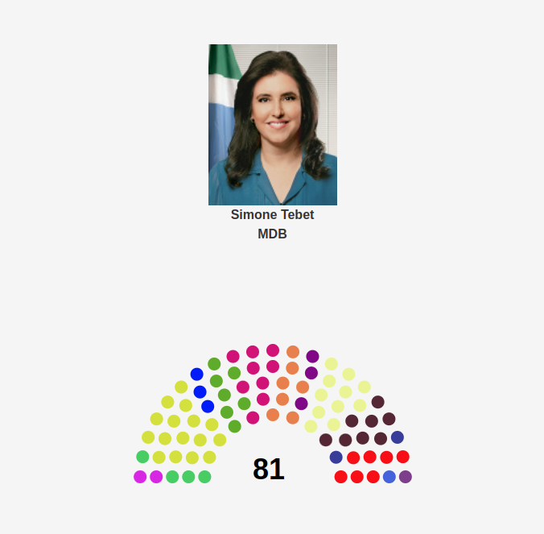

# Brazilian Senate Data Visualization

Interactive visualization of current Brazilian senators, using D3.js, HTML and CSS. Project made in the discipline of data visualization, CIn - UFPE 2022.1.

## 💻 Data Visualization

<h1 align="center">
    
</h1>

## Languages and Frameworks:

- HTML
- CSS
- Javascript
- D3.js

## Developers
* [Gabriel Nogueira](https://github.com/gabrielnogueiralt)
* [Matheus Alves Almeida](https://github.com/MatheusAlvesAlmeida)
